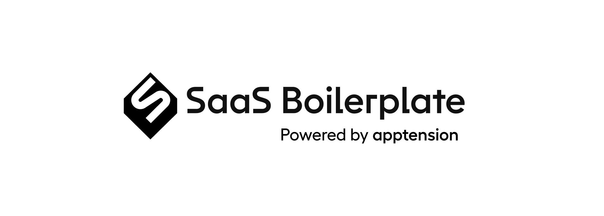
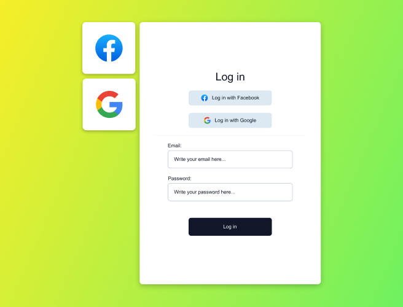
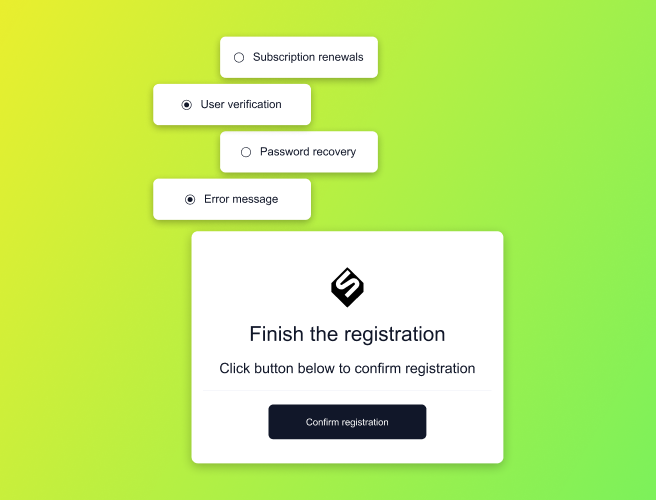
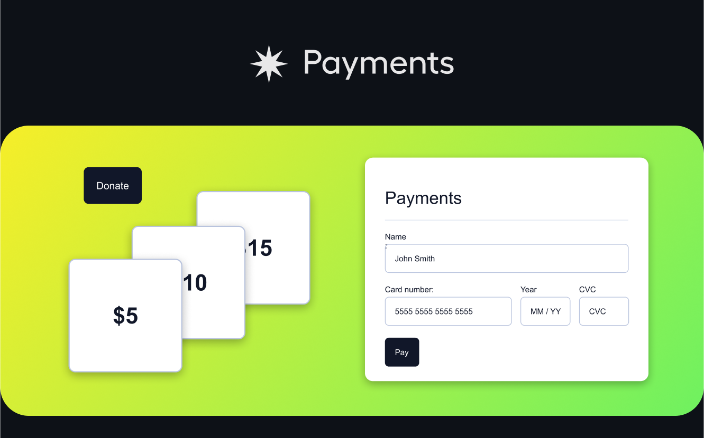
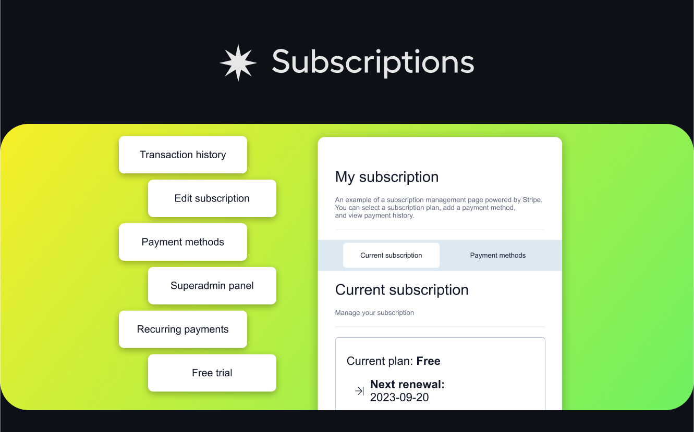
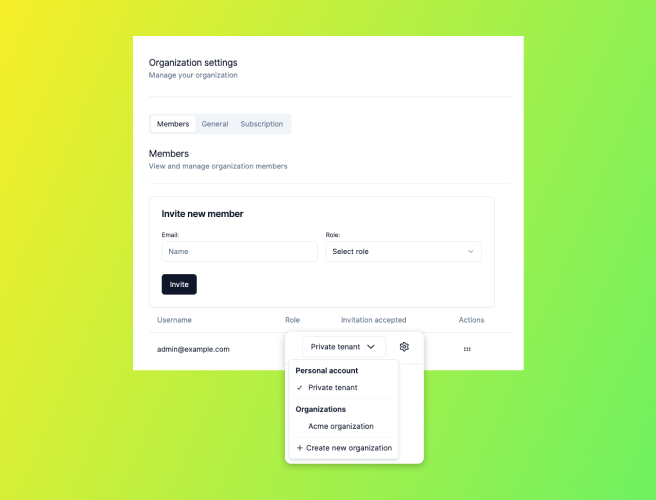

<p align="center">
  
</p>

<h1 align="center">Build SaaS products faster in React, Django and AWS.</h1>
<h2 align="center">A complete SaaS starter kit based on a battle-tested stack with out-of-the-box features every SaaS should have</h2>

<h4 align="center">
  <a href="https://github.com/apptension/saas-boilerplate">
    
  </a>

  <a href="https://github.com/apptension/saas-boilerplate">
    
  </a>

  <a href="https://twitter.com/apptension">
    
  </a>

  <a href="https://discord.apptension.com">
    
  </a>
</h4>

---

📖 [**SaaS Boilerplate Documentation**](https://docs.demo.saas.apptoku.com/)

🌟 [**SaaS Boilerplate Page**](https://www.apptension.com/saas-boilerplate?utm_source=readme-file&utm_medium=referral&utm_campaign=SaaS%20Boilerplate&utm_term=SaaS%20Boilerplate)

🚀 [**SaaS Boilerplate Demo**](https://app.demo.saas.apptoku.com/)

---

Supercharge your SaaS development with our comprehensive starter kit, designed to accelerate your project and save you
valuable time and resources. Our battle-tested boilerplate eliminates the need for extensive configuration and
development work, allowing you to focus on innovation from day one.

SaaS Boilerplate includes essential features that every SaaS application requires, such as frontend, backend API, admin
panel, and workers. With a scalable AWS-based architecture and continuous deployment, you can easily deploy multiple
environments representing different stages in your pipeline.

Say goodbye to weeks of setup and coding. Our proven stack and ready-to-use features empower you to jumpstart your
project and prioritize building your product's intellectual property. Unlock your SaaS potential faster than ever before
and seamlessly transition from setup to innovation.

## Getting started

### Requirements

- Install [Docker](https://docs.docker.com/get-docker)
- Install [Node.js](https://nodejs.org/en/download/) version 18 or above (which can be checked by running `node -v`).
  You can use [nvm](https://github.com/nvm-sh/nvm) or [n](https://github.com/tj/n) for managing multiple Node versions installed on a single machine.
- Install [pnpm](https://pnpm.io/installation) version 9 or above (which can be checked by running `pnpm --version`)
- (Windows only) Install [WSL 2](https://learn.microsoft.com/en-us/windows/wsl/install)

#### Optional

- Install [Python](https://www.python.org/downloads/) version 3.11 (which can be checked by running `python3 --version`) and [PDM](https://github.com/pdm-project/pdm/#installation) version 2.3 or above (which can be checked by running
  `pdm --version`)
  - You need this one if you want to run `pdm install` command in `packages/backend` or `packages/workers` outside
    docker container
  - You can use [`pyenv`](https://github.com/pyenv/pyenv) for managing multiple Python versions installed on a single machine.

### Fresh installation

#### Setup using CLI starter kit

You can use a special CLI tool to run a new local instance of the SaaS Boilerplate as soon as possible. It will clone
the repository and take care of setting up the environment. Run the following command in the directory where you would
like to create a new project:

**_Using `npm`:_**

```bash
npm init saas-boilerplate PATH
```

**_Using `pnpm`:_**

```bash
pnpm create saas-boilerplate PATH
```

**_Using `yarn`:_**

```bash
yarn create saas-boilerplate PATH
```

> :information_source: Where `PATH` is a directory name where to initialize project.
>
> :warning: **The init directory needs to be empty!**

#### Manual setup

For the manual setup clone this repository and follow the steps in
[Getting started guide](https://docs.demo.saas.apptoku.com/getting-started/run-project/run-new-project#manual-setup).

### Run existing project

> :warning: **If you are using a Windows machine**, it's mandatory to have **WSL 2** (Windows Subsystem for Linux)
> installed on your system to run the commands for installing dependencies and running the application.

#### Install dependencies

The project is configured to use pnpm workspaces, which means that you can install `node_modules` of all packages in
repository, with single command:

```sh
pnpm install
```

### Start the app

Start both: backend and webapp

```sh
pnpm saas up
```

#### Start backend

```sh
pnpm saas backend up
```

#### Start webapp

```sh
pnpm saas webapp up
```

#### Local documentation

In order to run your local documentation server execute following command:

```sh
pnpm saas docs up
```

## Features

<details open>
<summary>
This boilerplate includes plenty of ready to use features that you can adjust to you needs:
</summary> <br />

  <a href="https://docs.demo.saas.apptoku.com/introduction/features/auth">
    
  </a>
  <br /><br />
  
  <details open>
    <summary>
      <a href="https://docs.demo.saas.apptoku.com/introduction/features/auth">Authentication and authorization</a>
    </summary><br/>
    <ul>
      <li>User registration and login, including Facebook and Google OAuth</li>
      <li>Basic user data like name, surname, and user role for authorization</li>
      <li>User email address verification via a transactional email</li>
      <li>Password change and password recovery within the app flow</li>
      <li>User management panel in Django admin</li>
      <li>Two-factor authentication</li>
    </ul>
  </details>

  <a href="https://docs.demo.saas.apptoku.com/introduction/features/emails">
    
  </a>
  <br /><br />
  
  <details open>
    <summary>
      <a href="https://docs.demo.saas.apptoku.com/introduction/features/emails">Emails</a>
    </summary><br/>
    <ul>
      <li>A set of ready-to-send transactional emails (new user verification, password recovery, subscription renewals, errors, etc.)</li>
      <li>Ability to schedule emails at a given time</li>
      <li>Sending test emails directly from a Storybook</li>
      <li>Internationalization support out of the box</li>
    </ul>
  </details>

  <a href="https://docs.demo.saas.apptoku.com/introduction/features/payments">
    
  </a>
  <br /><br />
  
  <details open>
    <summary>
      <a href="https://docs.demo.saas.apptoku.com/introduction/features/payments">Payments</a>
    </summary><br/>
    <ul>
      <li>Integration with Stripe services and its dashboard</li>
      <li>No customer payment method data is stored locally</li>
      <li>Support for multiple payment methods and their management (storing for future use and removal)</li>
    </ul>
  </details>

  <a href="https://docs.demo.saas.apptoku.com/introduction/features/payments#subscription-management">
    
  </a>
  <br /><br />
  
  <details open>
    <summary>
      <a href="https://docs.demo.saas.apptoku.com/introduction/features/payments#subscription-management">Subscriptions</a>
    </summary><br/>
    <ul>
      <li>Ability to charge users immediately or to set up recurring payments</li>
      <li>Subscription plans support and ability to freely modify current plans</li>
      <li>Free trial subscription plan, a grace period for credit card issues</li>
      <li>Superadmin panel enables customer management (i.e. refunds) without the Stripe dashboard</li>
    </ul>
  </details>

  <a href="https://docs.demo.saas.apptoku.com/introduction/features/multi-tenancy">
    
  </a>
  <br /><br />
  
  <details open>
    <summary>
      <a href="https://docs.demo.saas.apptoku.com/introduction/features/multi-tenancy">Multi-tenancy</a>
    </summary><br/>
    <ul>
      <li>Start immediately with a default tenant provided upon account creation</li>
      <li>Add new tenants as needed to manage multiple entities within a single account</li>
      <li>Utilize three default roles ”Owner, Admin, and Member” to control tenant activities and collaboration</li>
      <li>Securely invite and manage new members within each tenant</li>
    </ul>
  </details>

  <a href="https://docs.demo.saas.apptoku.com/introduction/features/cms">
    
  </a>
  <br /><br />
  
  <details open>
    <summary>
      <a href="https://docs.demo.saas.apptoku.com/introduction/features/cms">CMS integration &#40;Contentful&#41;</a>
    </summary><br/>
    <ul>
      <li>Integration with Contentful service</li>
      <li>Example content model (image, title, and description)</li>
      <li>Ready to use CMS with a free plan</li>
    </ul>
  </details>

---

</details>

... and more

The full list with the descriptions can be found in the [features documentation](https://docs.demo.saas.apptoku.com/introduction/features/).

## Tech stack

Front-end stack:

- [React](https://github.com/facebook/react)
- [GraphQL](https://graphql.org/)
- [Apollo Client](https://github.com/apollographql/apollo-client)
- [tailwindcss](https://github.com/tailwindlabs/tailwindcss)
- [shadcn/ui](https://github.com/shadcn-ui/ui)
- [styled-components](https://github.com/styled-components/styled-components) (optional)
- [jest](https://github.com/jestjs/jest)
- [Storybook](https://github.com/storybookjs/storybook)
- [Vite](https://github.com/vitejs/vite)

Back-end stack:

- [Python](https://www.python.org/)
- [Django](https://github.com/django/django)
- [Django REST Framework](https://github.com/encode/django-rest-framework)
- [Graphene Django](https://github.com/graphql-python/graphene)
- [dj-stripe](https://github.com/dj-stripe/dj-stripe/)
- [Postgres](https://www.postgresql.org/)

Infrastructure:

- [NX](https://github.com/nrwl/nx)
- AWS infrastructure written in [AWS CDK](https://github.com/aws/aws-cdk)
- Github or Bitbucket

3rd party services:

- Stripe
- Contentful
- Sentry
- SonarCloud
- OpenAI

The [detailed stack description](https://docs.demo.saas.apptoku.com/introduction/stack-description) is available in the documentation.

## How was the SaaS Boilerplate created?

In our experience in Apptension, we have built hundreds of web and mobile applications over the years and saw a bunch of standard features. For example, all applications (or at least 99% of them) need a login, email templating, payments and subscriptions, CMS integration, and more.

A broader list of elements that can be implemented in projects in this way was created after building dozens of different types of SaaS products. We analyzed them and noticed many common parts appeared virtually unchanged. So we created SaaS Boilerplate that is the base, and while it requires design or functional customization for a specific SaaS product, it dramatically reduces development time.

That's why you don't have to start by writing the code for that login or payment function. Instead, you can use off-the-shelf elements in those places and focus on creating the rest of the features unique to the project.

The development process is ongoing as we continually add new features and improve existing ones. We started with AWS Boilerplate, which evolved into the current SaaS Boilerplate. It originally contained only infrastructure (a configured AWS account) and was a template for the project, which had blanks for the back-end and front-end.

We saw that it was already a handy and very well-received tool, so the next natural step was to add more elements to it – front-end, back-end, and pack the relevant features that were most often repeated in different projects, including logging, CRUD, payments, integration with content pool, etc.

Our idea was that it shouldn't be just the code itself because SaaS Boilerplate also contains our know-how – because we gathered everything needed for development and around development in one package. So you don't have to think about choosing code formatting, matching different tools and their subsequent configuration, etc. Moreover, such a package is proven and battle-tested – you can just upload it to the cloud and start so-called heavy development.

## Who are we?

We're [Apptension](https://apptension.com?utm_source=readme-file&utm_medium=referral&utm_campaign=SaaS%20Boilerplate&utm_term=SaaS%20Boilerplate), a team that turns ideas into world-class software using expertise in technology, design, and product management. We work with founders, investors, and creative agencies to help them bring uncommon ideas to the market.

Our partners value our outside-the-box thinking, clear and honest communication, and reliability – even in the most dynamic and time-compressed projects. Among our clients – plenty of early-stage startups, as well as international tech behemoths like Netflix and Uber. We live and breathe tech – and we're darn good at it.

To bring even more value to our partners, we create bespoke tools (like SaaS Boilerplate), allowing us to shorten time-to-market while avoiding technical debt.

## License

SaaS Boilerplate is licensed under the [MIT License](./LICENSE).

## Contributing to SaaS Boilerplate

We welcome contributions from anyone interested in improving SaaS Boilerplate. Please keep in mind that this project follows a [Code of Conduct](./CODE_OF_CONDUCT.md) to ensure a welcoming community for all.

For more detailed information on how to contribute to this project, please refer to our [Contributing Guide](./CONTRIBUTING.md).

If you have any questions about contributing, please join our [Discord server](https://discord.apptension.com) - we are happy to help you!

Thank you for considering contributing to SaaS Boilerplate!
